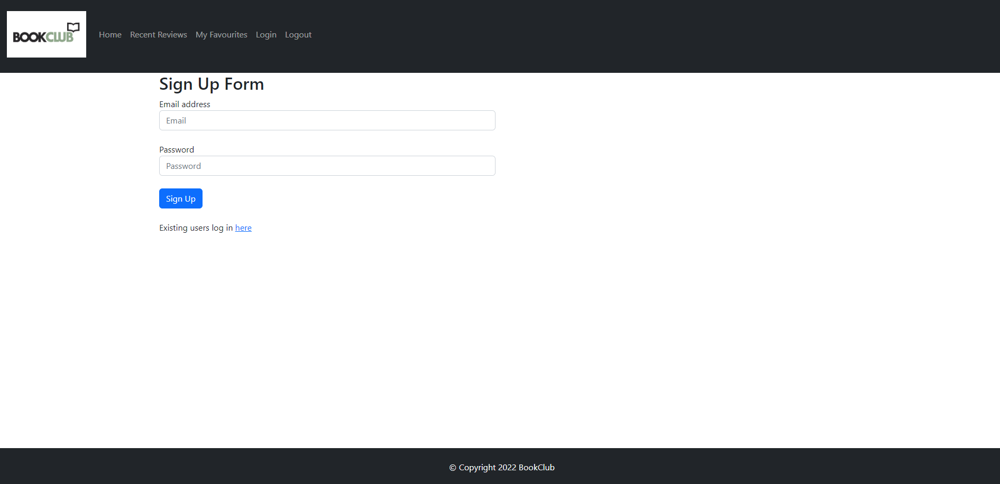

# BookClub

BookClub is an online book enthusiasts database whereby the user can browse their favourite book titles, and write a brief review.

Deployed URL of the application: https://aqueous-woodland-15580.herokuapp.com/

## Table of Contents

- [Installation](#installation)
- [Usage](#usage)
- [Credits](#credits)
- [License](#license)

## Installation

- npm i bootstrap
- npm i mysql2
- npm i express
- npm i express-session
- npm i express-handlebars
- npm i handlebars
- npm i heroku
- npm i inquirer
- npm i sequelize
- npm i dotenv
- npm i bcrypt
- npm i axios

## Usage

- Please use npm start to execute the server.js file.
- Sign up as a new user and log in as necessary. When the session is over, please log out.
- Browse book titles and save them as your favourite.

## Credits

N/A

## License

Please refer to the repo.